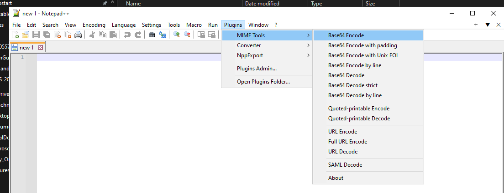

% Base64 on Windows Workarounds
% Jacek Kowalczyk
% November 22, 2023


# base64 on windows 

https://stackoverflow.com/questions/37046771/base64-encode-string-command-line-windows

## Different encoding results  Git Bash and MSYS2 vs something else 

```
echo 21184067-14fa-4ec8-99d6-aea45eef590a | base64
```


**Git Bash and MSYS2 INCORRECT!!!**

MjExODQwNjctMTRmYS00ZWM4LTk5ZDYtYWVhNDVlZWY1OTBhCg==

online tool: 
**https://www.base64encode.org/**
MjExODQwNjctMTRmYS00ZWM4LTk5ZDYtYWVhNDVlZWY1OTBh


powershell "[convert]::ToBase64String([Text.Encoding]::UTF8.GetBytes(\"21184067-14fa-4ec8-99d6-aea45eef590a\"))"


***
<div style="page-break-after: always; visibility: hidden;">\\pagebreaks</div>s

## Intellij plugin https://plugins.jetbrains.com/plugin/2162-string-manipulation

https://plugins.jetbrains.com/plugin/2162-string-manipulation

## Python 

```
# This is a sample Python script.

# Press Shift+F10 to execute it or replace it with your code.
# Press Double Shift to search everywhere for classes, files, tool windows, actions, and settings.
import base64

TEST_STRING = "this is test text to base64 encoding"


def print_hi(name):
    # Use a breakpoint in the code line below to debug your script.
    print(f'Hi, {name}')  # Press Ctrl+F8 to toggle the breakpoint.

def encode(sample_string) :
    # sample_string = "GeeksForGeeks is the best"
    sample_string_bytes = sample_string.encode("UTF-8")

    base64_bytes = base64.b64encode(sample_string_bytes)
    base64_string = base64_bytes.decode("UTF-8")

    print(f"{sample_string} as Base64 encoded string: {base64_string}")
    return base64_string

def decode(base64_string):
    import base64

    # base64_string = " R2Vla3NGb3JHZWVrcyBpcyB0aGUgYmVzdA =="
    base64_bytes = base64_string.encode("UTF-8")

    decoded_string_bytes = base64.b64decode(base64_bytes)
    decoded_string = decoded_string_bytes.decode("UTF-8")

    print(f"Base64: {base64_string} Decoded: {decoded_string}")
    return decoded_string


# Press the green button in the gutter to run the script.
if __name__ == '__main__':
    print_hi('PyCharm')
    encode(TEST_STRING)


```
 
 Tests for base64 encoding decoding 
 
```
import unittest
from main import encode
from main import decode
from main import TEST_STRING


class MyTestCase(unittest.TestCase):
    def test_encode(self):
        self.assertEqual("dGhpcyBpcyB0ZXN0IHRleHQgdG8gYmFzZTY0IGVuY29kaW5n", encode(TEST_STRING))  # add assertion here

    def test_encode_dupa(self):
        self.assertEqual("ZHVwYQ==", encode("dupa"))  # add assertion here

    def test_decode(self):
        self.assertEqual(TEST_STRING, decode("dGhpcyBpcyB0ZXN0IHRleHQgdG8gYmFzZTY0IGVuY29kaW5n"))  # add assertion here

if __name__ == '__main__':
    unittest.main()

```

***
<div style="page-break-after: always; visibility: hidden;">\\pagebreaks</div>s

## java.util.Base64

https://www.baeldung.com/java-base64-encode-and-decode
https://www.baeldung.com/java-base64-encode-and-decode


```
import java.util.Base64;

public class MyDecoder {

    public static String decodeBase64(final String encodedString) {
        String decodedString = null;
        try{
            byte[] decodedBytes = Base64.getDecoder().decode(encodedString);
            decodedString = new String(decodedBytes);
        } catch (IllegalArgumentException iae) {
            log.warn("Input String is not valid Base64, returning original input data", iae);
            decodedString = encodedString;
        } finally {
            return decodedString;
        }
    }
	
}


import java.util.Base64;

// Press Shift twice to open the Search Everywhere dialog and type `show whitespaces`,
// then press Enter. You can now see whitespace characters in your code.
// https://www.baeldung.com/java-base64-encode-and-decode

public class MyBase64 {


    public static void encodeBase64(String originalInput) {
        String encodedString = Base64.getEncoder().encodeToString(originalInput.getBytes());
        System.out.println(originalInput + " encoded to Base64: " + encodedString);
    }

    public static void decodeBase64(String base64String) {
        byte [] decodedStringBytes = Base64.getDecoder().decode(base64String);
        String decodedString = new String(decodedStringBytes);
        System.out.println("Base64: " + base64String + " Decoded: " + decodedString);
    }

    public static void main(String[] args) {

        encodeBase64("gf2koek");
        encodeBase64("trudnehaslo");

        
        decodeBase64("dHJ1ZG5laGFzbG8="); 

    }
}

```

***
<div style="page-break-after: always; visibility: hidden;">\\pagebreaks</div>s

## notepad++



***
<div style="page-break-after: always; visibility: hidden;">\\pagebreaks</div>s
